# Instalación y Configuración de MySQL

## Información del Estudiante

- **Nombre completo:** Camilo Andrés García Almeida
- **Sistemas Operativos utilizados:** Windows 10/11 (instalación completa desde cero) y Ubuntu 22.04.4 LTS — entorno CampusOS de CampusLands (validación de un entorno preconfigurado)

## Contexto

Como parte del proceso de "Onboarding" como Desarrollador Junior, se realizó la instalación y configuración del entorno de desarrollo local utilizando el motor de base de datos **MySQL Server** y la herramienta visual **MySQL Workbench**. La actividad se documentó en dos entornos complementarios: primero se validó el funcionamiento de una instalación ya existente en el entorno de laboratorio de CampusLands (Ubuntu), y posteriormente se realizó el proceso de **instalación completa desde cero en Windows**, capturando cada etapa del instalador oficial.

## Proceso de Instalación (Windows — desde cero)

1. **Descarga del instalador oficial:** Se accedió al sitio oficial `dev.mysql.com/downloads/installer/` y se descargó el paquete completo **MySQL Installer Community 8.0.46** (565.9 MB), evitando la versión "web" para garantizar mayor estabilidad durante el proceso.
2. **Omisión de registro en Oracle:** Al iniciar la descarga, el sitio solicitó iniciar sesión o crear una cuenta Oracle. Se utilizó la opción **"No thanks, just start my download"**, sin necesidad de registrarse.
3. **Tipo de instalación:** Se ejecutó el instalador y se seleccionó el tipo de configuración **"Full"**, para instalar todos los componentes necesarios: MySQL Server, MySQL Workbench, MySQL Shell, MySQL Router, documentación y ejemplos.
4. **Instalación de productos:** El instalador descargó y completó la instalación de los 6 productos seleccionados (MySQL Server 8.0.46, MySQL Workbench 8.0.47, MySQL Shell 8.0.46, MySQL Router 8.0.46, Documentation y Samples/Examples).
5. **Configuración de red:** Se configuró el servidor como **"Development Computer"**, habilitando conexión por TCP/IP en el puerto estándar **3306** y apertura automática de los puertos en el Firewall de Windows.
6. **Método de autenticación:** Se mantuvo la opción recomendada **"Use Strong Password Encryption for Authentication"** (SHA-256), la más segura para instalaciones nuevas de MySQL 8.
7. **Definición de credenciales (Accounts and Roles):** Se estableció la contraseña del usuario **root**, y adicionalmente se creó un usuario personalizado **`camilog`** con rol **DB Admin**, accesible desde cualquier host (`%`).
8. **Configuración del servicio de Windows:** Se configuró MySQL Server como servicio del sistema (`MySQL80`), con inicio automático al arrancar Windows, ejecutado bajo cuenta estándar del sistema.
9. **Aplicación de la configuración:** Se ejecutaron todos los pasos de configuración (escritura de archivo de configuración, reglas de firewall, ajuste del servicio, inicialización de la base de datos, permisos de archivos, inicio del servidor, aplicación de seguridad y creación de cuentas de usuario), finalizando con el mensaje **"The configuration for MySQL Server 8.0.46 was successful"**.
10. **Verificación de conexión y carga de ejemplos:** Se verificó la conexión al servidor recién instalado utilizando las credenciales de root, y se completó la instalación de los esquemas de ejemplo (Samples and Examples).
11. **Apertura de herramientas:** Al finalizar, el instalador abrió automáticamente **MySQL Shell** y **MySQL Workbench**, mostrando la conexión preconfigurada **"Local instance MySQL80"**.
12. **Conexión y validación final:** Se conectó exitosamente desde MySQL Workbench a la instancia local, y se ejecutó la sentencia SQL de validación del entorno (ver sección correspondiente).

## Proceso de Validación (Ubuntu — entorno CampusLands)

De forma complementaria, se verificó el correcto funcionamiento de una instalación de MySQL ya existente en el entorno de laboratorio de CampusLands (Ubuntu 22.04.4 LTS):

1. Se confirmó que el servicio `mysql.service` se encuentra activo mediante `systemctl status mysql`, obteniendo el estado `active (running)`.
2. Se verificó la versión instalada mediante el comando `mysql --version` en terminal, confirmando **MySQL 8.0.46** para Ubuntu 22.04 (x86_64).
3. Se revisaron las conexiones configuradas en MySQL Workbench (usuarios `root` y `campus2023`), confirmando el establecimiento previo de credenciales de acceso.
4. Se estableció conexión exitosa desde MySQL Workbench y se ejecutó la consulta de validación del entorno.

## Galería de Evidencias

### A. Instalación completa en Windows (desde cero)

**Captura 1: Página oficial de descarga del instalador**

Selección del paquete completo MySQL Installer Community 8.0.46 para Windows.

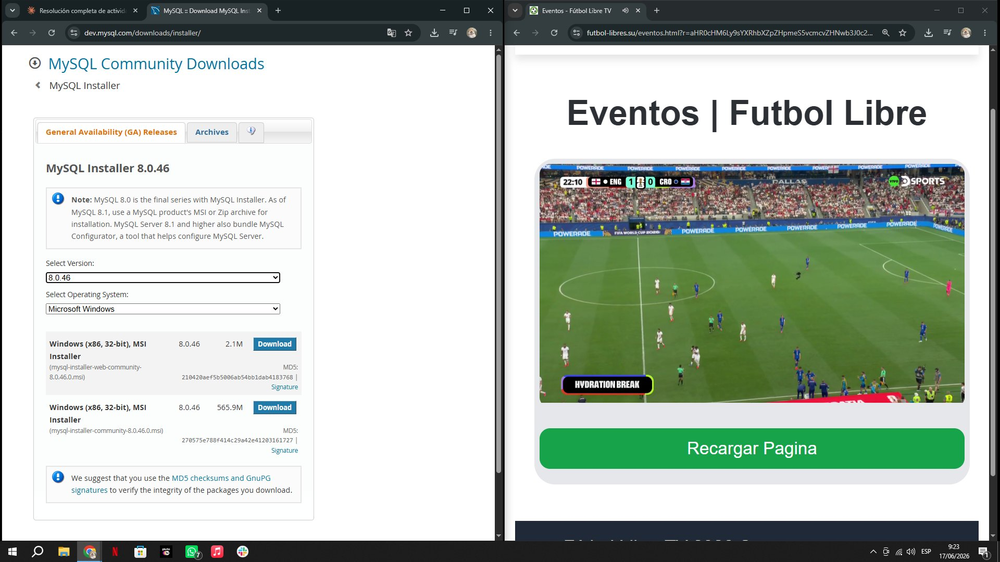

**Captura 2: Descarga sin necesidad de cuenta Oracle**

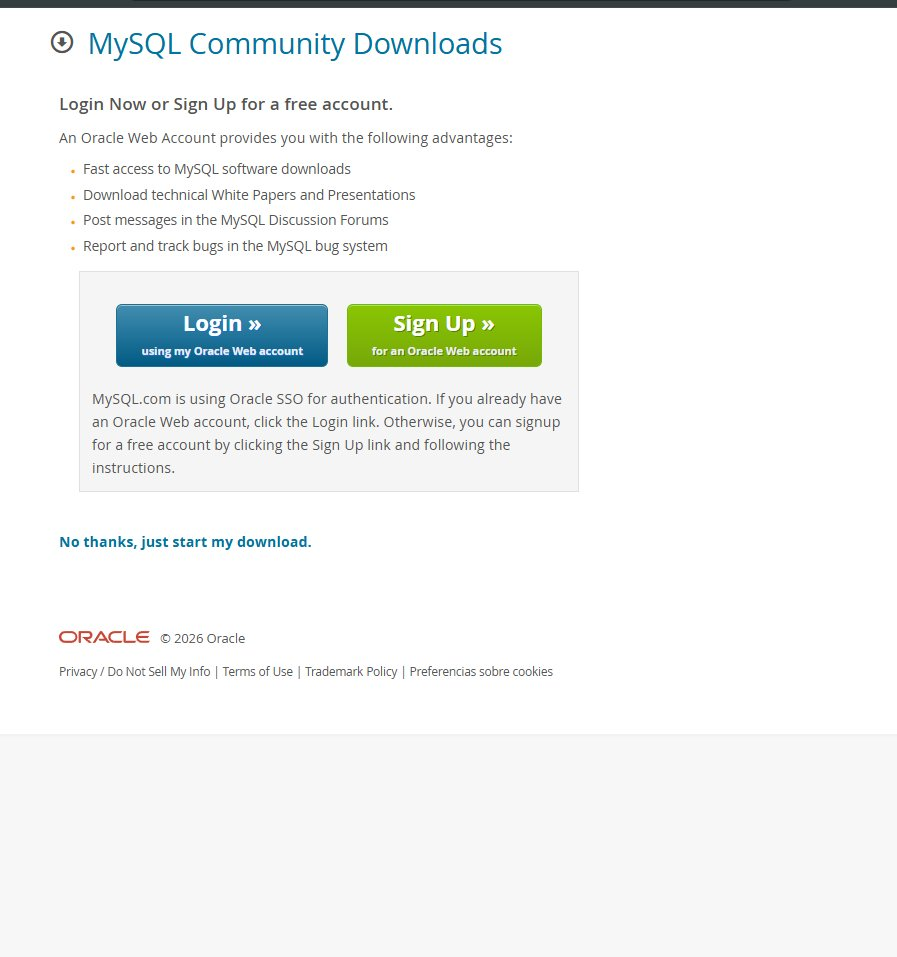

**Captura 3: Instalador ejecutándose — selección de tipo de instalación**

El instalador en ejecución, seleccionando el tipo de configuración "Full".

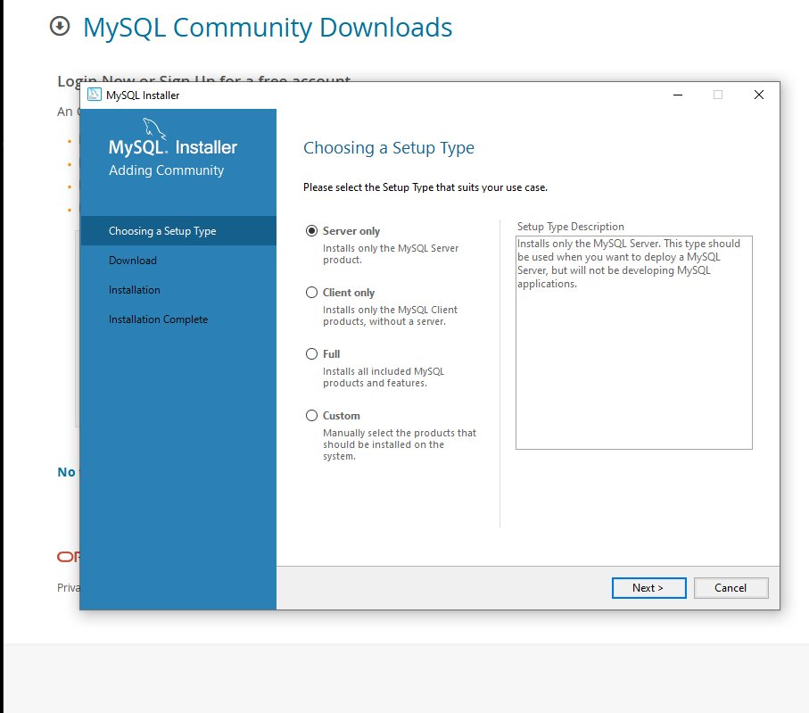

**Captura 4: Lista de productos a instalar**

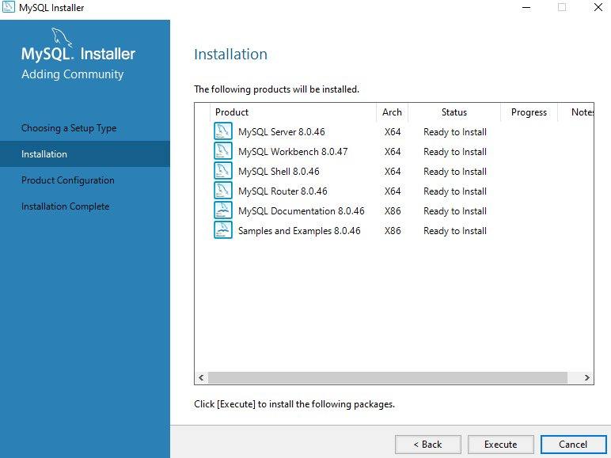

**Captura 5: Instalación completada**

Todos los productos (MySQL Server, Workbench, Shell, Router, Documentation y Samples) instalados exitosamente.

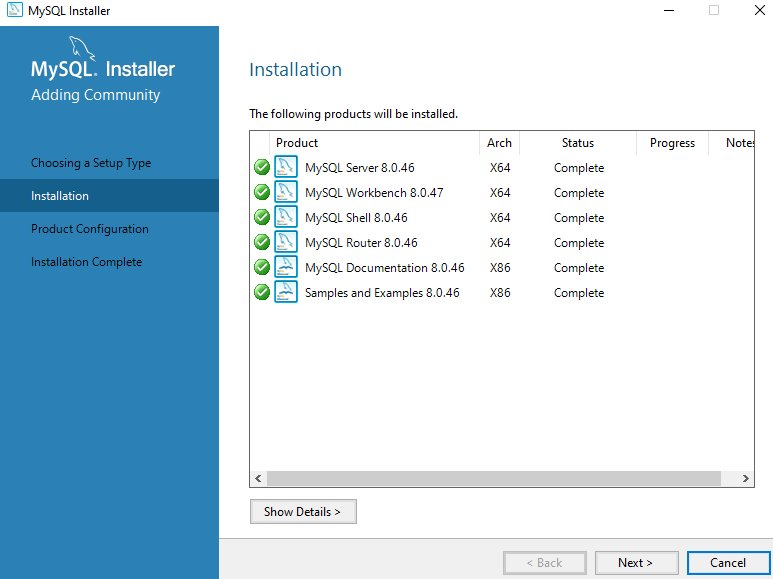

**Captura 6: Configuración de red del servidor**

Configuración de tipo "Development Computer", puerto TCP/IP 3306 y reglas de firewall.

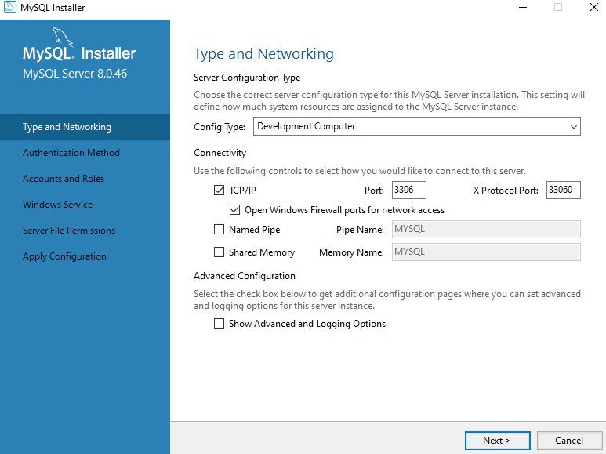

**Captura 7 (Captura clave — definición de credenciales): Configuración de contraseña de root**

Momento exacto donde se define y confirma la contraseña del usuario `root`.

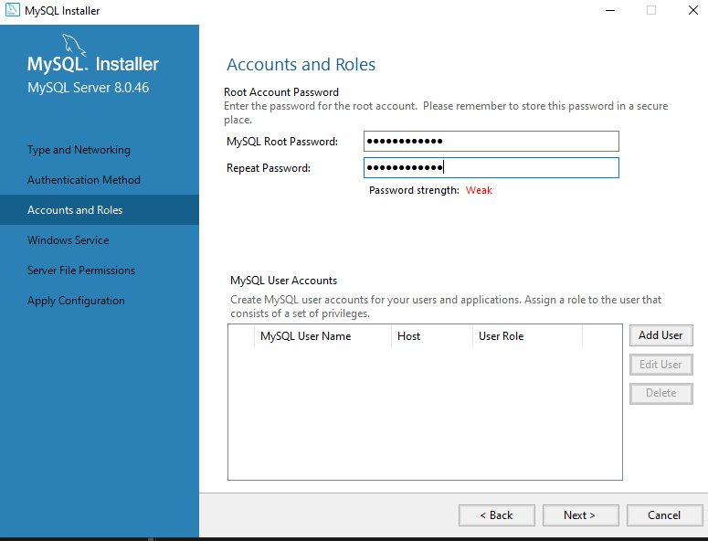

**Captura 8: Usuario personalizado creado**

Usuario `camilog` agregado con rol "DB Admin", visible en la tabla de cuentas de MySQL.

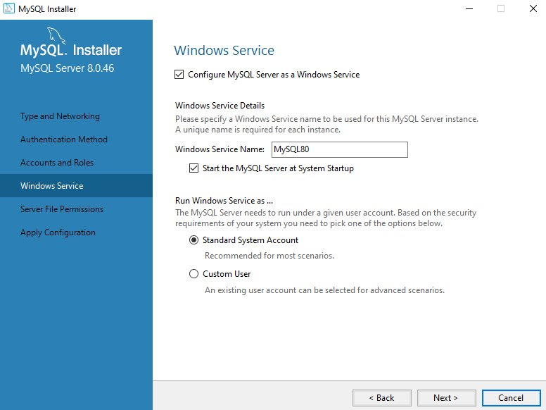

**Captura 9: Configuración del servidor aplicada exitosamente**

Todos los pasos de configuración completados en verde, con mensaje de éxito.

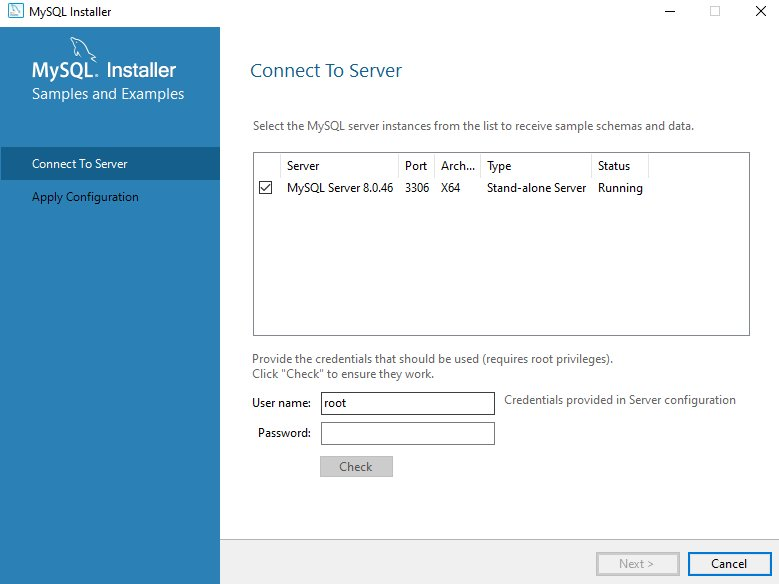

**Captura 10: MySQL Shell y MySQL Workbench abiertos automáticamente**

Al finalizar la instalación, ambas herramientas se abrieron mostrando la conexión "Local instance MySQL80".

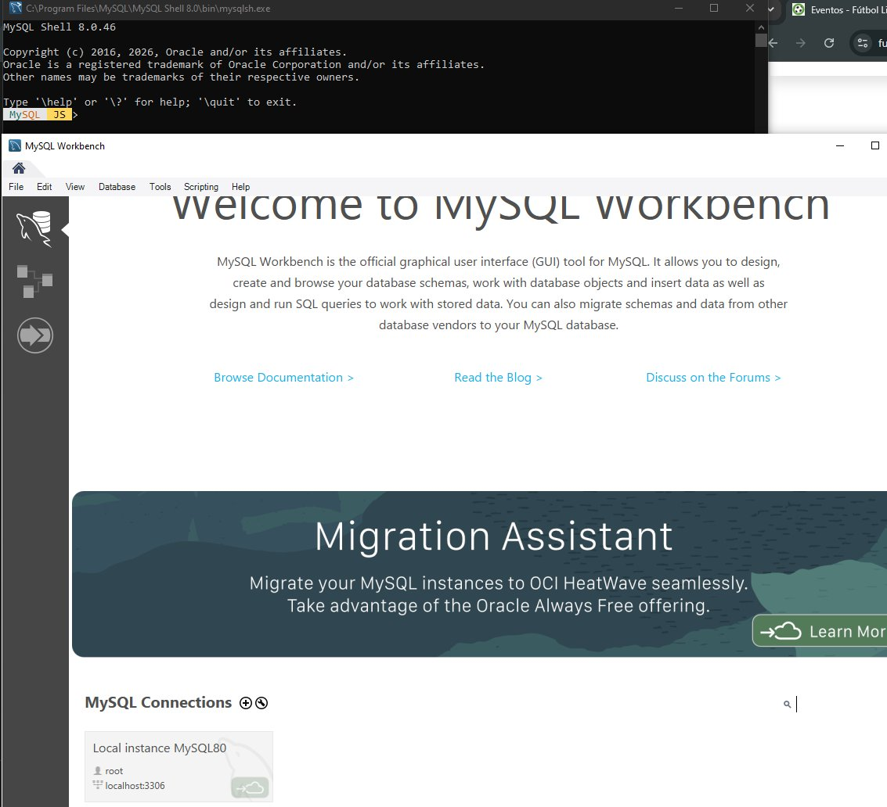

**Captura 11: MySQL Workbench conectado a la instancia local**

Conexión establecida exitosamente, con el editor SQL y el panel de navegación disponibles.

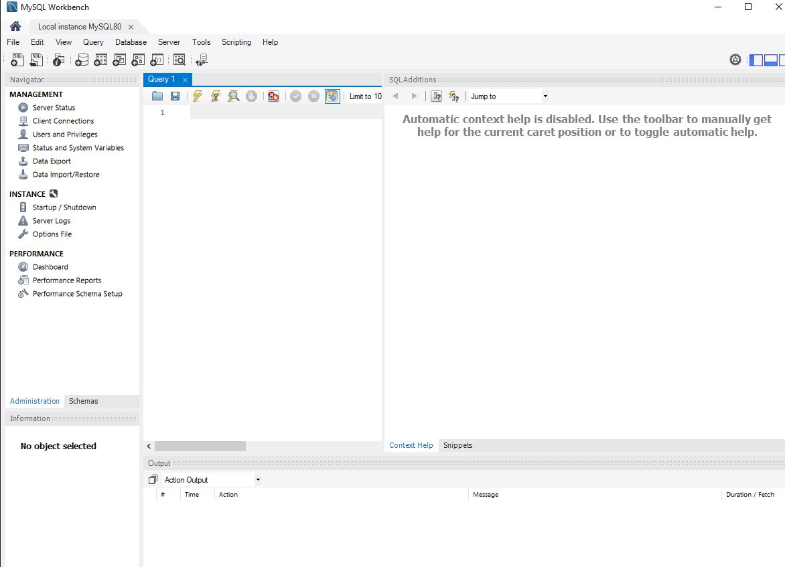

### B. Validación en entorno Linux (CampusLands)

**Captura 12: Servicio de MySQL Server activo (Ubuntu)**

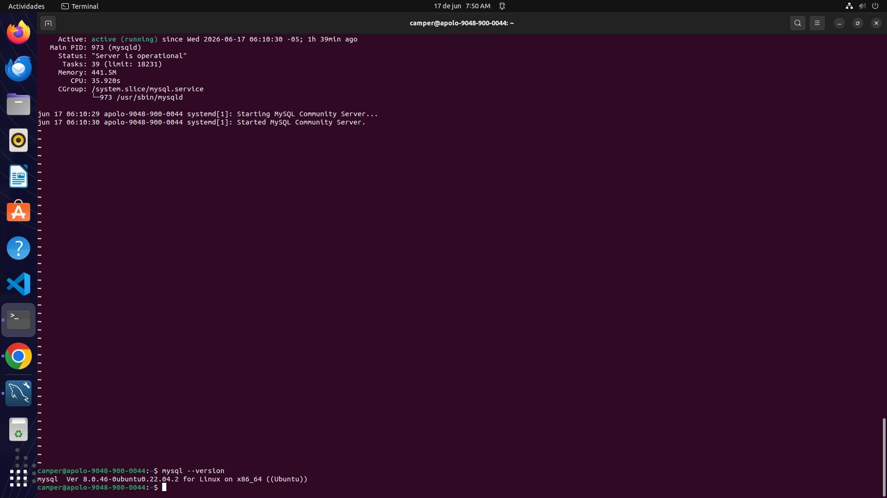

**Captura 13: Conexiones configuradas en MySQL Workbench (Ubuntu)**

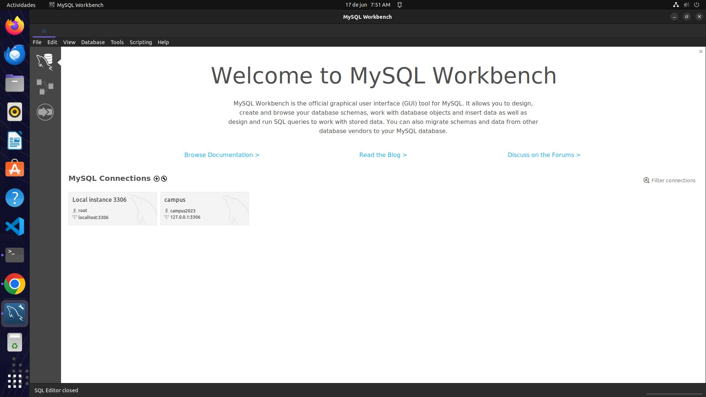

## Sentencia de Validación

Para confirmar que la instalación fue exitosa, en ambos entornos se ejecutó la siguiente consulta SQL dentro de una pestaña de Query en MySQL Workbench:

```sql
-- Consulta de validación de entorno
SELECT VERSION() AS 'Versión de MySQL',
       CURRENT_USER() AS 'Usuario Actual',
       NOW() AS 'Fecha y Hora del Servidor';
```

### Resultado de la consulta — Windows (instalación nueva)

| Versión de MySQL | Usuario Actual  | Fecha y Hora del Servidor |
|-------------------|------------------|------------------------------|
| 8.0.46             | root@localhost   | 2026-06-17 09:44:09          |

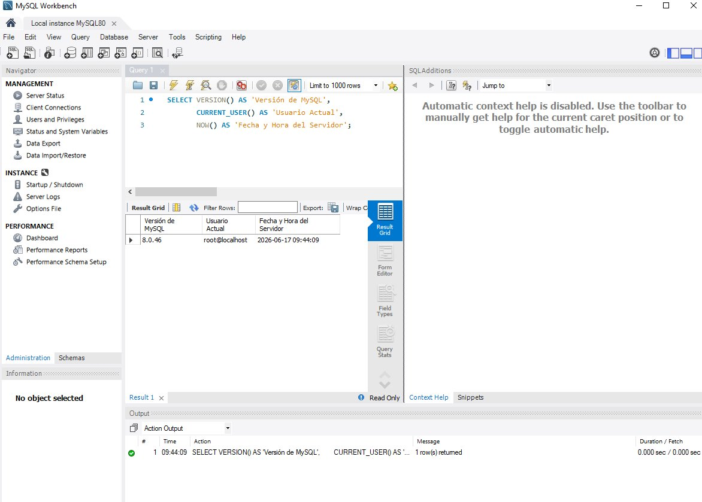

### Resultado de la consulta — Ubuntu (CampusLands)

| Versión de MySQL          | Usuario Actual   | Fecha y Hora del Servidor |
|----------------------------|------------------|----------------------------|
| 8.0.46-0ubuntu0.22.04.2    | campus2023@%     | 2026-06-17 07:52:43        |

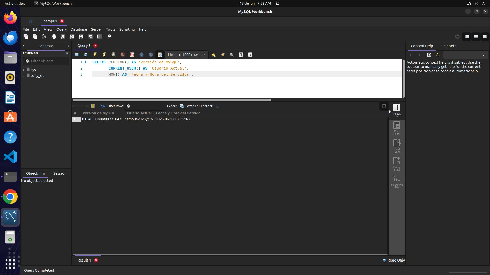

## Conclusión

Se completó exitosamente el proceso de instalación de MySQL Server y MySQL Workbench desde cero en Windows, documentando cada etapa del instalador oficial: descarga, selección de componentes, configuración de red, definición de credenciales de acceso (incluyendo la creación de un usuario personalizado), aplicación de la configuración del servicio, y verificación final mediante una consulta SQL. Adicionalmente, se validó el correcto funcionamiento de una instalación ya existente en el entorno de laboratorio de CampusLands sobre Ubuntu, confirmando en ambos casos la versión del motor de base de datos, el usuario activo de la sesión y la fecha/hora del servidor.
